# Chart Gallery

Every figure on this page came out of a **single method call** on a `Portfolio`
or a `Data` object. No axes configured, no colours chosen, no subplot grids
assembled.

All of it renders from the price fixtures already in the repository
(`tests/test_jquantstats/resources`). The subject is a 20/100-day
moving-average crossover on AAPL and META — de-volatised by a 32-day EWMA
estimate, $1m AUM, 15% annualised volatility target, 5bp turnover cost:

```python
import polars as pl
from jquantstats._cost_model import CostModel
from jquantstats.portfolio import Portfolio

signal = prices.with_columns((pl.col(a).rolling_mean(20) - pl.col(a).rolling_mean(100)).sign() * budget for a in assets)

pf = Portfolio.from_risk_position(
    prices=prices,
    risk_position=signal,
    aum=1_000_000.0,
    vola=32,
    cost_model=CostModel.turnover_bps(5.0),
)
```

Regenerate every image below with:

```bash
uv run --with pillow python book/shots/generate.py
```

!!! note "The images are static; the figures are not"

    Each chart below is a `plotly.graph_objects.Figure`. In a notebook or a
    browser you get hover tooltips, zoom, legend toggles and — on the
    time-series charts — a working range selector. The images below are
    flattened exports;
    click any of them for the full-resolution version.

---

## Portfolio — position-level analysis

The `Portfolio` route is built from prices *and* positions, so these charts can
reach the holdings underneath the return series. None of them are available
from a return stream alone.

### `pf.plots.snapshot()`

Accumulated profit split three ways — total NAV against its tilt and timing
components — over the drawdown path. Forty-four years, 11,183 daily
observations, one call.

[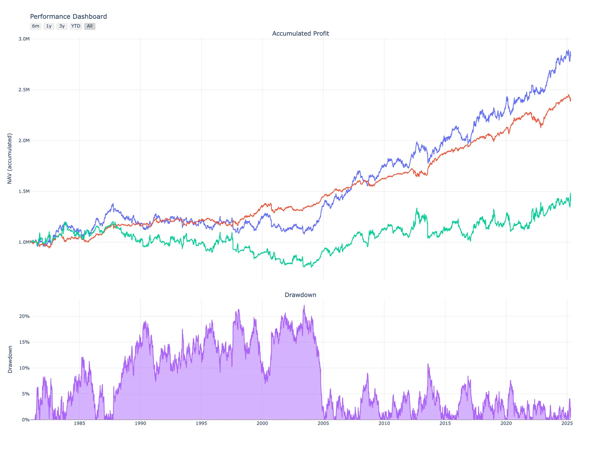](shots/portfolio-snapshot.webp)

### `pf.plots.lead_lag_ir_plot()`

Sharpe recomputed with the position book shifted from ten days early to
nineteen days late. Negative lags peek at the future and score 1.6; the red bar
at lag 0 — the only tradeable one — is 0.44. A whole look-ahead audit in one
method.

[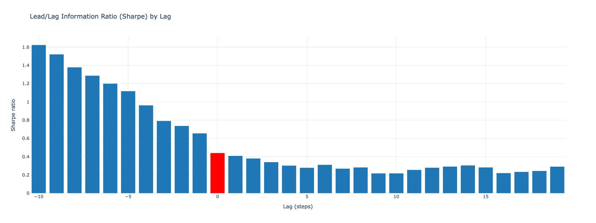](shots/portfolio-lead-lag-ir.webp)

### `pf.plots.lagged_performance_plot()`

The same NAV path re-accumulated at execution delays of nought to four days.
The fan is the decay: each extra day of slippage in getting orders down costs
about $140k of terminal profit.

[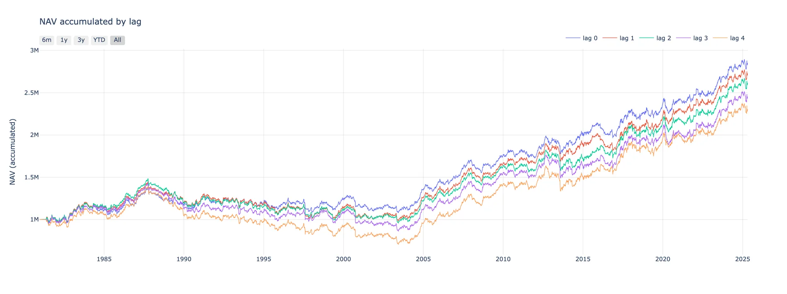](shots/portfolio-lagged-performance.webp)

### `pf.plots.smoothed_holdings_performance_plot()`

The complement to the lag sweep: instead of delaying the book, average it over
a trailing window. Cheaper to trade, and here it costs surprisingly little.

[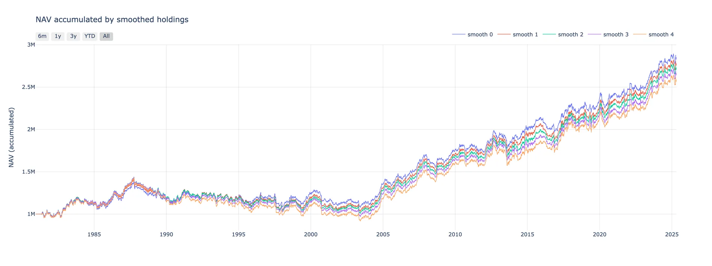](shots/portfolio-smoothed-holdings.webp)

### `pf.plots.trading_cost_impact_plot(max_bps=20)`

Annualised Sharpe as a function of one-way cost, swept from 0 to 20bp against
the frictionless baseline. The slope is the strategy's cost sensitivity — this
one gives up 0.06 Sharpe over the full sweep.

[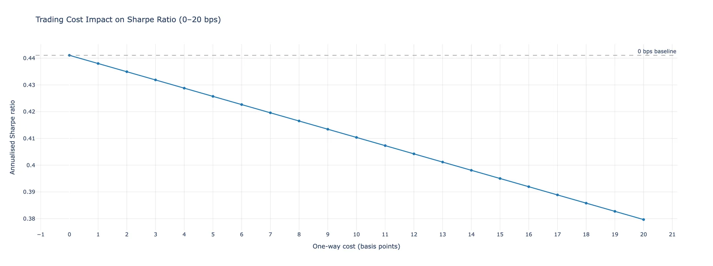](shots/portfolio-trading-cost-impact.webp)

### `pf.plots.rolling_sharpe_plot(window=252)`

One-year trailing Sharpe, swinging between roughly −2 and +3.5 for four
decades without settling. A useful corrective: the strategy's 0.44 lifetime
Sharpe is an average across regimes, not a description of any of them.

[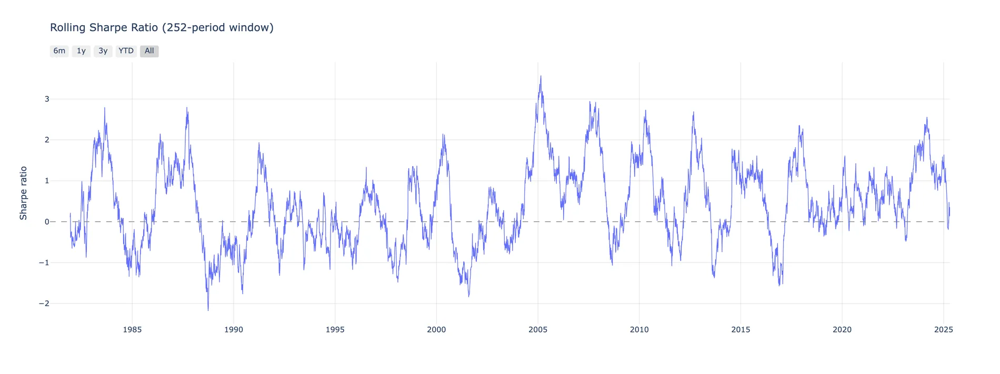](shots/portfolio-rolling-sharpe.webp)

### `pf.plots.annual_sharpe_plot()`

The same series bucketed by calendar year — the best years clear 2.5, the worst
drops below −1.2.

[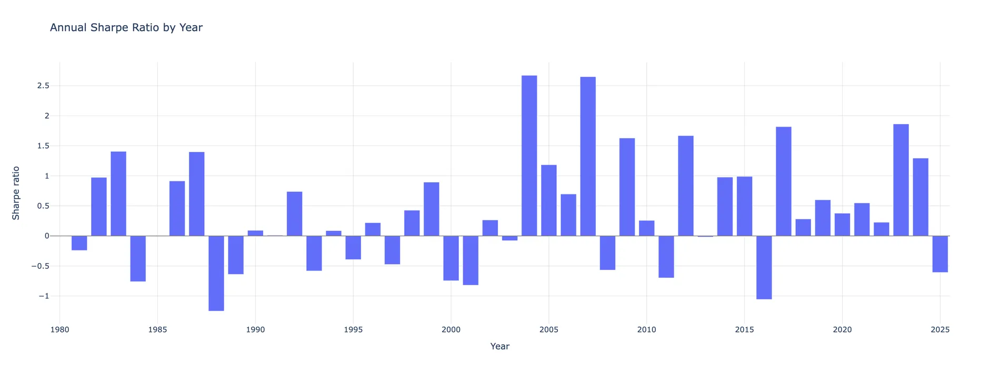](shots/portfolio-annual-sharpe.webp)

### `pf.plots.monthly_returns_heatmap()`

Forty-five calendar years of the strategy, greened and reddened around zero.
The dead band in the early rows is META trading flat before its 2012 listing.

!!! tip "Give it room"

    This one keeps the 600px default height, which squeezes 45 rows of months
    into unreadable slivers. Pass your own: `fig.update_layout(height=1500)`.

[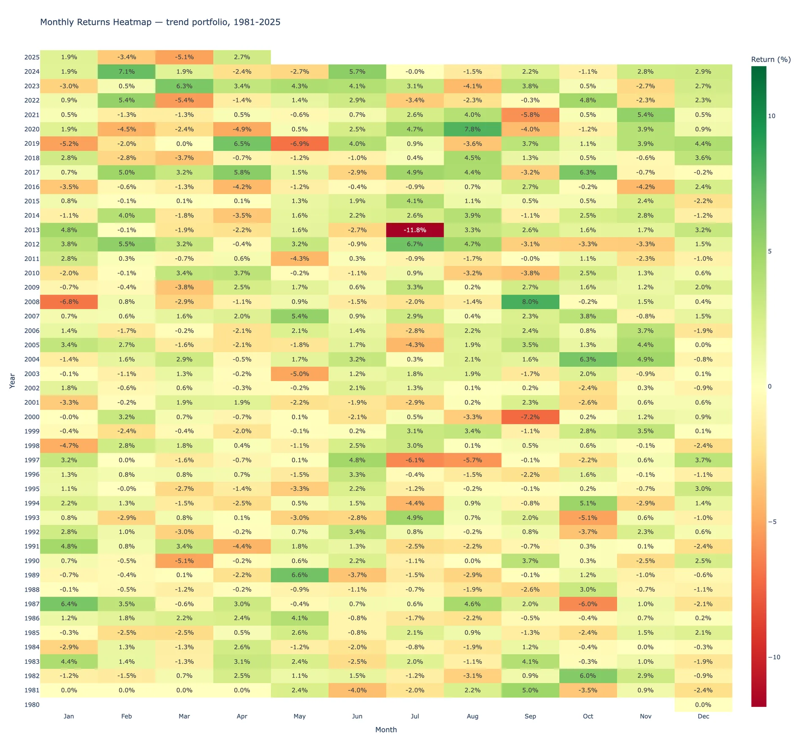](shots/portfolio-monthly-heatmap.webp)

### `pf.plots.correlation_heatmap()`

Twenty US large caps plus the strategy's own P&L appended to the matrix, so you
can read what the book is actually long — GOOG at 0.51, RRC at −0.11.

[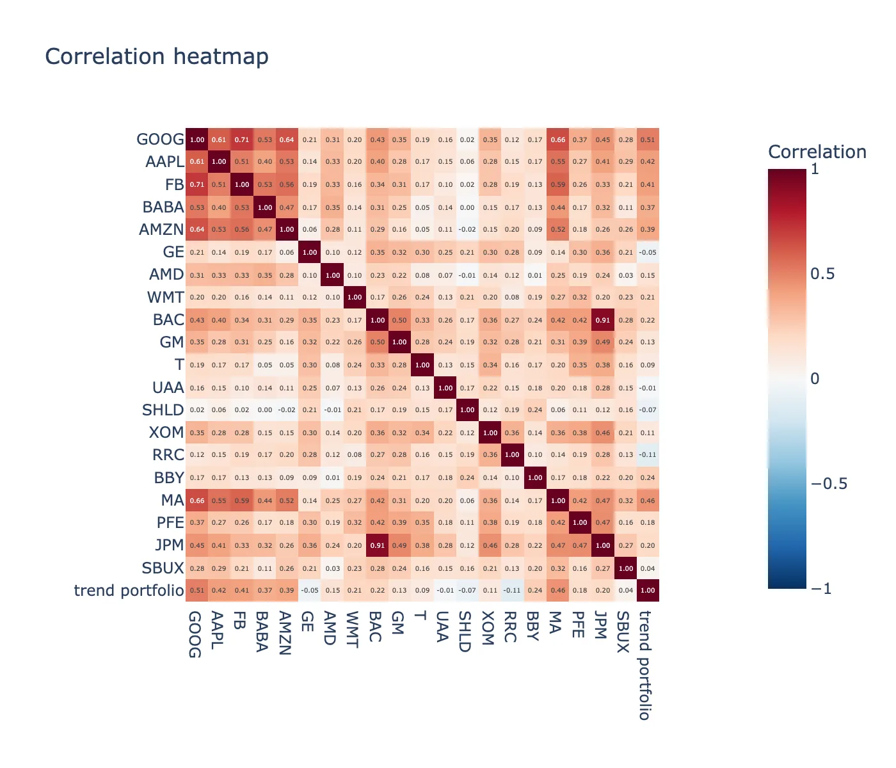](shots/portfolio-correlation-heatmap.webp)

---

## Data — return streams

The `Data` route takes any stream of returns at all; no positions required.
Below: AAPL against SPY from 1993, and AAPL with META from META's 2012
listing.

### `data.plots.snapshot(log_scale=True)`

Cumulative return, the full drawdown envelope and every monthly bar, stacked
and sharing one x-axis. AAPL compounds to 500×; the −80% trough of the early
2000s is right there underneath it.

[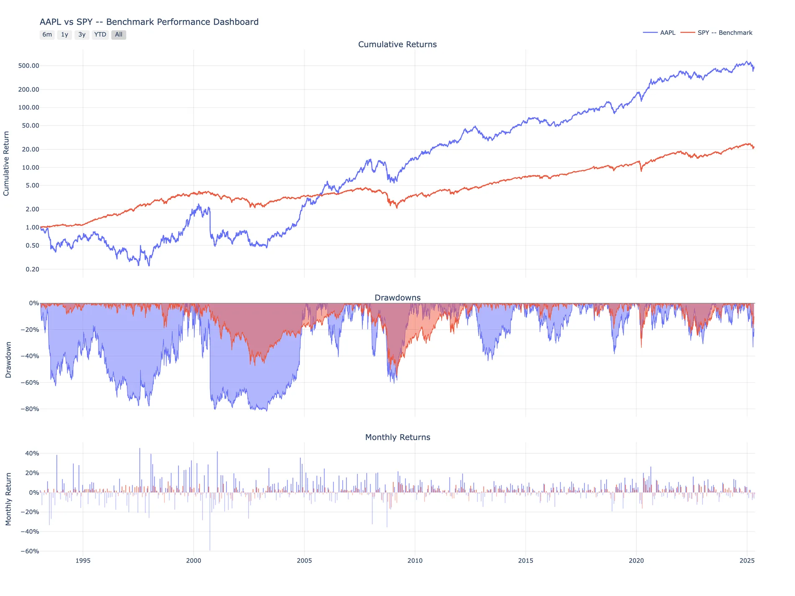](shots/data-snapshot.webp)

### `data.plots.compare()`

Cumulative growth multiple from a common start of 1.0×, assets against the
benchmark on one axis.

[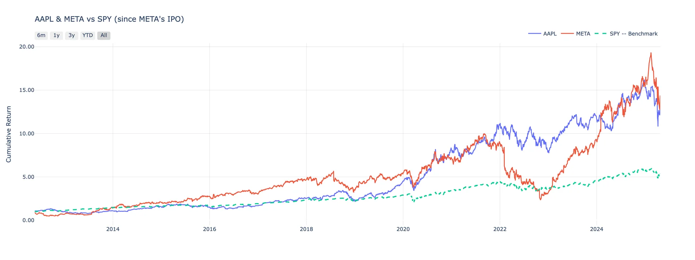](shots/data-compare.webp)

### `data.plots.drawdowns_periods(n=5)`

Each drawdown found, ranked and shaded in place on the equity curve with its
depth annotated. Number one ran from 2000 to 2005 and took 81.8%.

[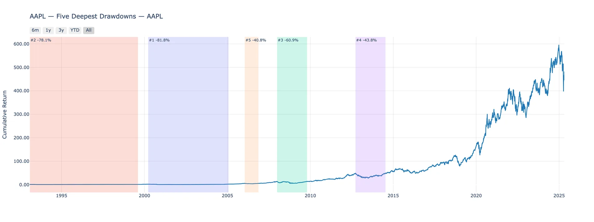](shots/data-drawdown-periods.webp)

### `data.plots.monthly_heatmap()`

September 2000 at −57.7% and January 2001 at +45.4%, in the same frame.
Compounded within each month by default.

[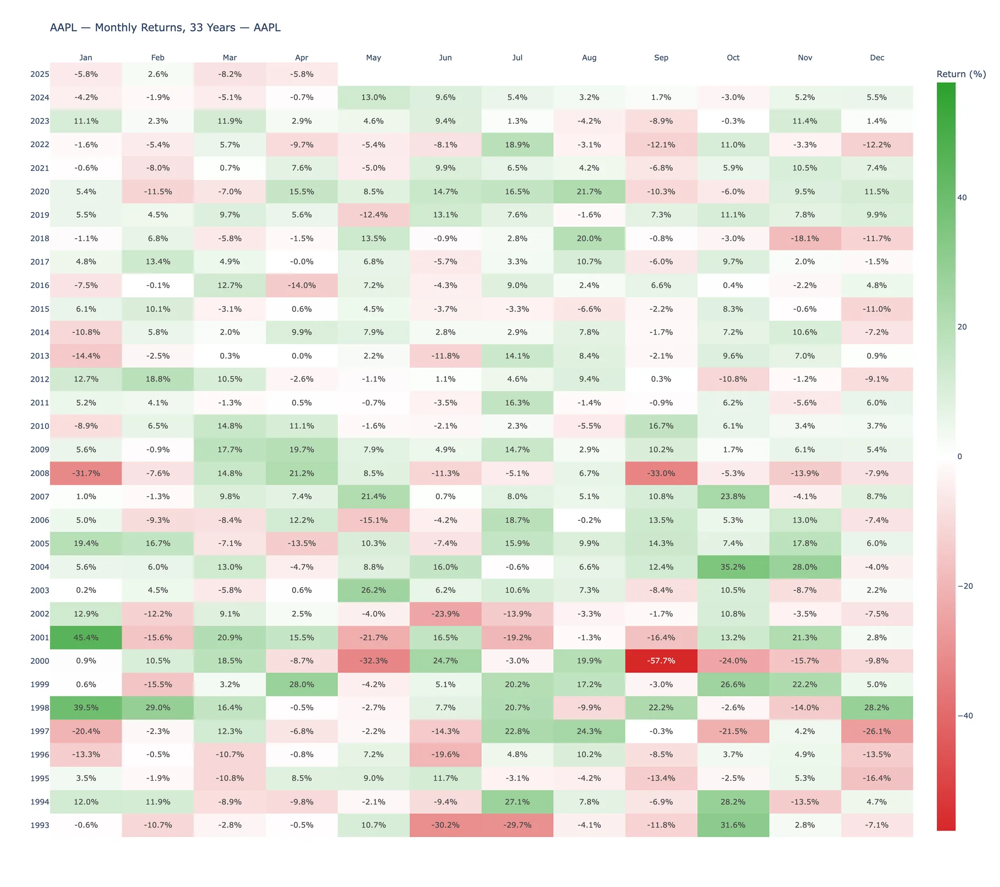](shots/data-monthly-heatmap.webp)

### `data.plots.yearly_returns()`

Paired bars, faded when negative, so the years the asset lost to the index read
instantly. 1998 and 2004 both cleared 200%.

[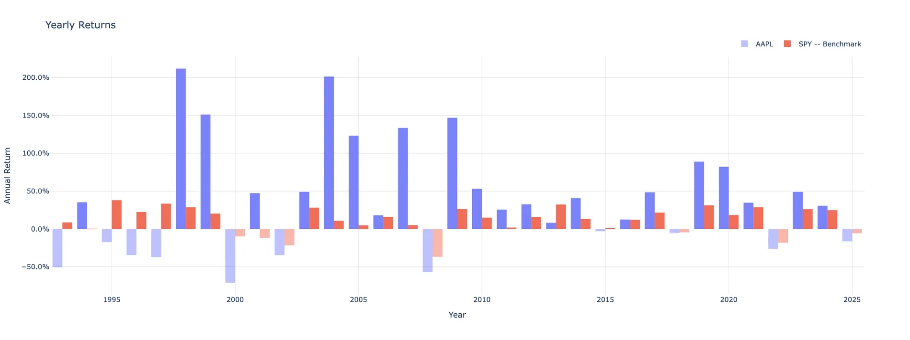](shots/data-yearly-returns.webp)

### `data.plots.distribution()`

Daily through yearly box plots, one panel per asset. The tails widen from a few
percent a day to well past ±100% a year as you move right.

[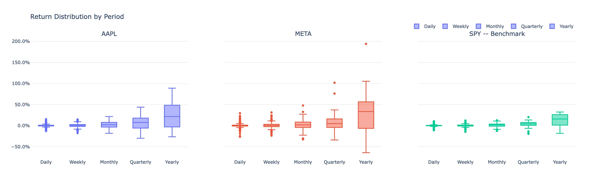](shots/data-distribution.webp)

### `data.plots.histogram(bins=120)`

Semi-transparent histograms overlaid on shared axes, one per series. AAPL's fat
tails reach past ±10% a day; SPY's peak is twice as tall and half as wide.

[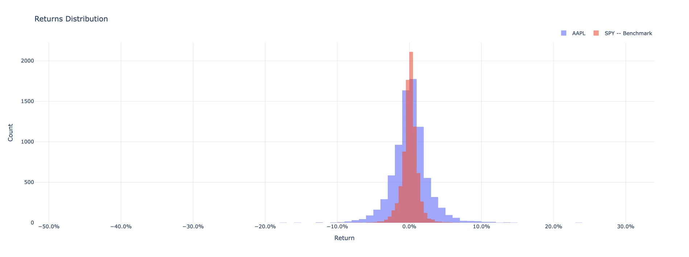](shots/data-histogram.webp)

### `data.plots.montecarlo(n=300)`

The last trading year resampled with replacement, three hundred times per
asset, drawn faint behind the realised path so the observed year reads against
its own cone.

[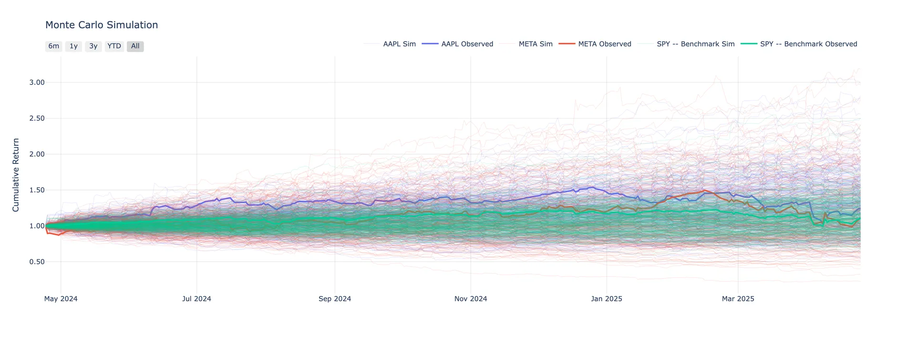](shots/data-montecarlo.webp)

### `data.plots.montecarlo_distribution(n=2000)`

The same resampling, collapsed to a metric. Two thousand draws of the annual
Sharpe with the observed value marked as a dashed line — which lands
mid-distribution, well inside the noise.

[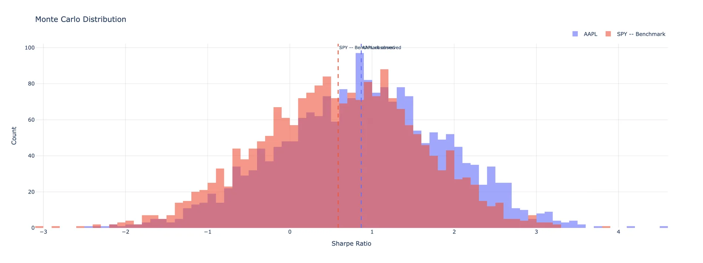](shots/data-montecarlo-distribution.webp)

### `data.plots.rolling_sharpe()`

Six-month trailing annualised Sharpe, one line per asset plus the benchmark, so
you can see who was carrying the period. The lines cross constantly — no asset
owns it.

[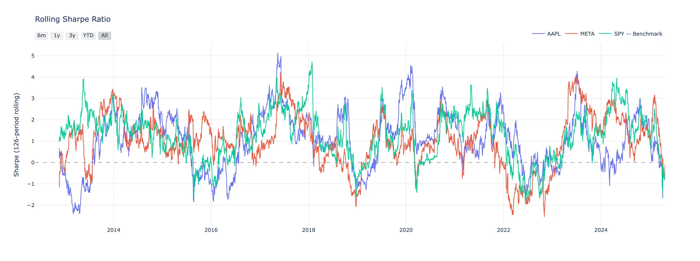](shots/data-rolling-sharpe.webp)

### `data.plots.rolling_volatility()`

Six-month trailing annualised volatility, same treatment.

[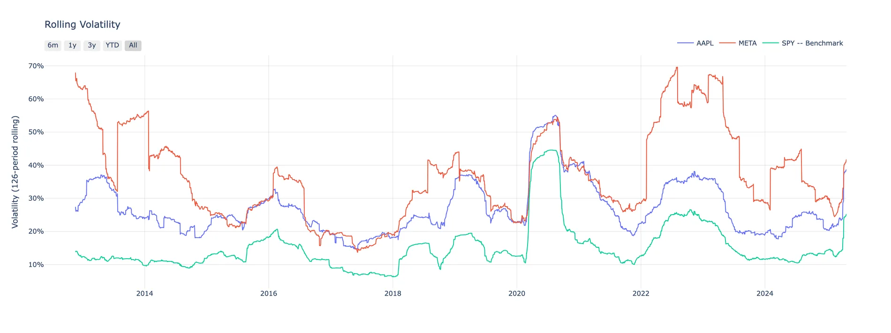](shots/data-rolling-volatility.webp)

### `data.plots.rolling_beta()`

Trailing OLS beta to the benchmark at a 126-day and a 504-day window.

[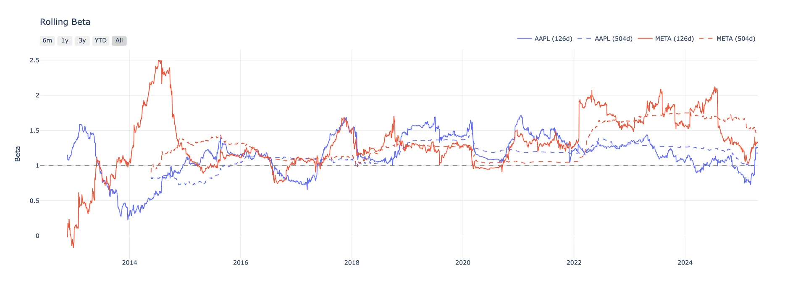](shots/data-rolling-beta.webp)

---

## `reports.full()` — the whole tearsheet, one call

Returns a complete, self-contained dark-themed HTML document. No server, no
build step, nothing to ship alongside it:

```python
html = data.reports.full(title="Performance Report")
pathlib.Path("report.html").write_text(html)
```

### Metrics

Overview, risk-adjusted ratios, drawdown, trading, recent returns, smart
ratios, risk and averages — one column per asset, tabular figures throughout.

[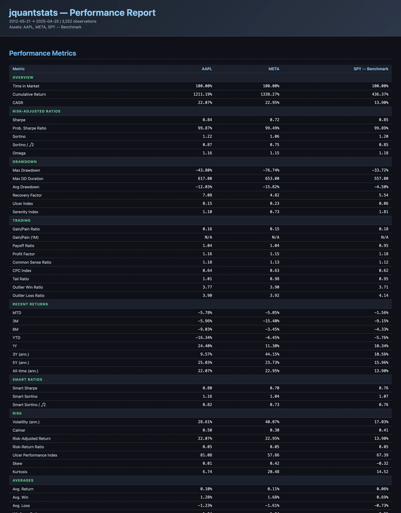](shots/report-metrics.webp)

### Drawdowns

Worst five drawdown periods per asset: start, valley, end, depth and duration.
An em dash in the End column means the drawdown was still open on the last
observation.

[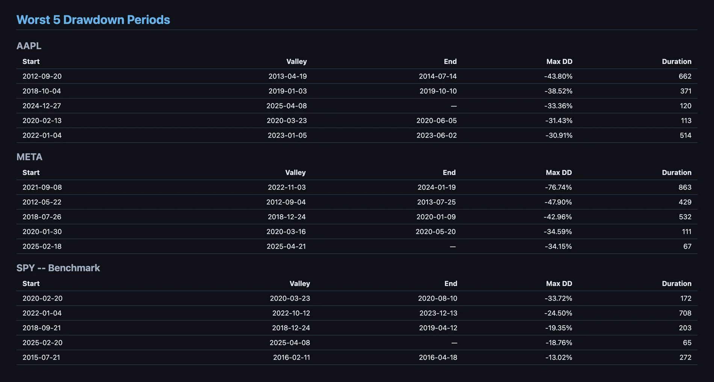](shots/report-drawdowns.webp)

### Charts

The Plotly figures come through as real interactive plots inside the document —
zoom, hover and range-select all still work in the saved file.

[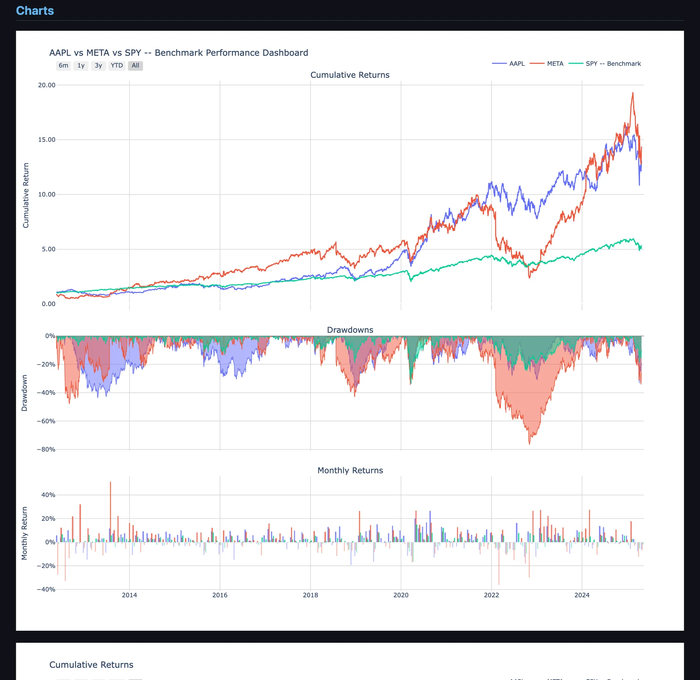](shots/report-charts.webp)

---

Want to build these yourself? Start with [Getting
Started](getting_started.md), then work through the [example
notebooks](examples.md) — [Plots and
Reports](notebooks/plots_and_reports.html) covers the `plots` facade in full.
